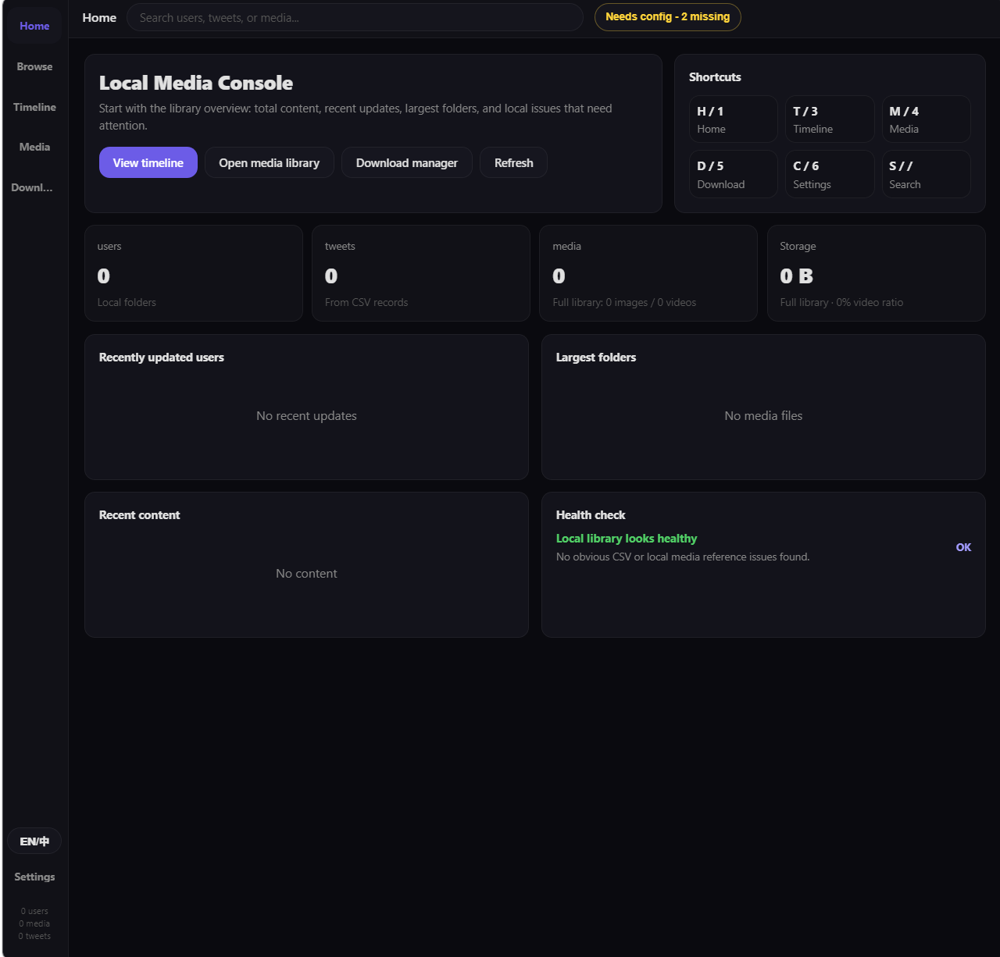
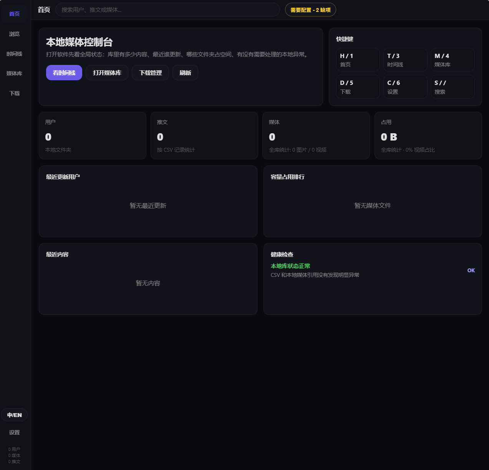
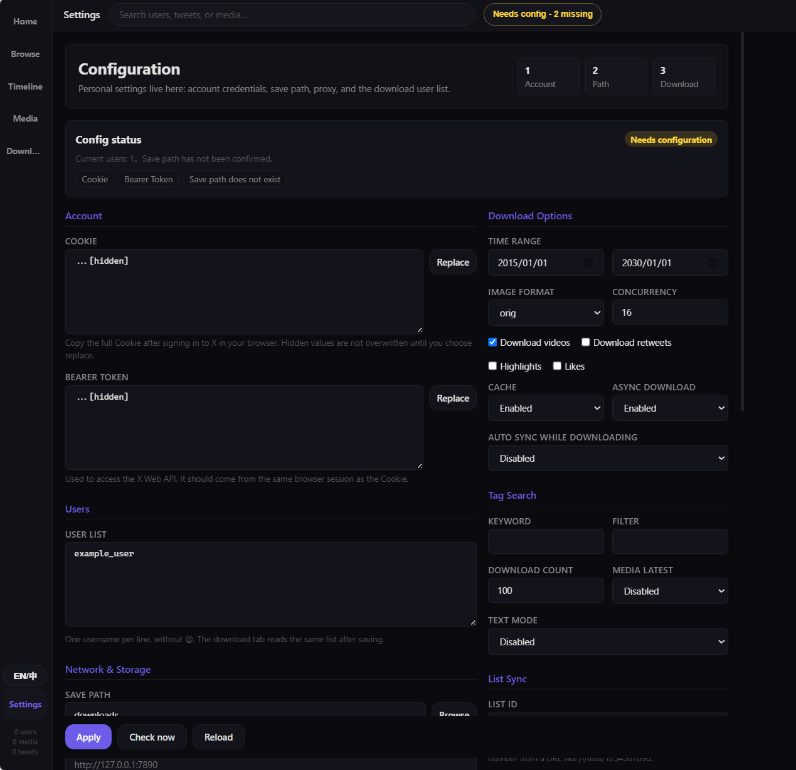
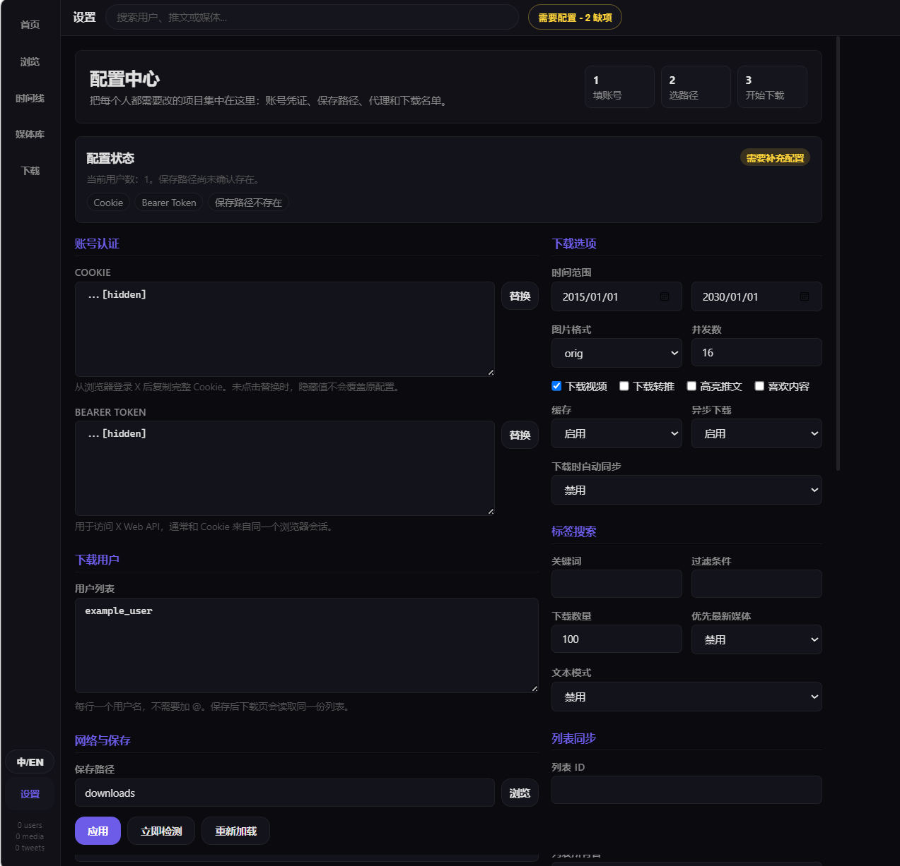

# xDownloader

A bilingual local X/Twitter media downloader and browser with a Windows installer, timeline, media library, and hot-applied settings.

中英双语本地 X/Twitter 媒体下载与浏览器，支持 Windows 安装包、时间线、媒体库和前端即时配置。

## Download / 下载

For most Windows users, download the installer from the latest GitHub Release.

大多数 Windows 用户建议直接从最新 GitHub Release 下载安装包。

[Download xDownloader Setup / 下载 xDownloader 安装包](https://github.com/DocJ2000/xDownloader/releases/latest)

- Choose `xDownloader-Setup-*.exe` for the guided installer.
- Choose `xDownloader-*-windows.zip` if you prefer a portable executable.
- Choose GitHub's automatically generated source code archive if you want to build or modify the project.
- 普通用户请选择 `xDownloader-Setup-*.exe`，这是带安装向导的版本。
- 想免安装运行的用户请选择 `xDownloader-*-windows.zip`。
- 想阅读、修改或自行构建项目的开发者，可以下载 GitHub 自动生成的源码包。

## Interface Preview / 界面预览

xDownloader provides a full English and Chinese bilingual interface. The language can be switched inside the app.

xDownloader 提供完整中英文双语界面，用户可以在软件内一键切换语言。

### Home - English



### 首页 - 中文



### Settings - English



### 设置 - 中文



## English

xDownloader is a local X/Twitter media downloader and browser. It downloads media and text tweets for configured users, can sync users from an X list, and provides a browser-based local UI for browsing users, timeline items, and media.

### Windows Installer

The recommended installer is `xDownloader-Setup-*.exe` from GitHub Releases.

- The installer lets users choose the install folder.
- `config.json` is created in the install folder on first run.
- Windows gets a normal uninstall entry, plus an uninstaller in the install folder.
- No Python installation is required for the installer build.
- The Settings tab lets users edit personal configuration and click `Apply` to use it immediately.

### Feature Preview

- Browse downloaded media locally without opening original tweet links.
- Timeline view shows local archived posts by time.
- Settings cover account credentials, save path, date range, list sync, tag search, text download, retry, logging, and theme.
- Example preview data uses public-person demo names such as Elon Musk and Donald J. Trump only as mock UI content.

### List Sync Tips

List ID is preferred. Open a list page on X in your browser and copy the numeric ID from a URL like:

```text
https://x.com/i/lists/1234567890
```

If you do not have the numeric ID, use List Owner plus List Slug. The owner is the account screen name, and the slug is the list name in the URL.

### Run From Source

```bash
pip install -r requirements.txt
copy config.example.json config.json
python xdownloader.py
```

Open the local UI if it does not open automatically:

```text
http://127.0.0.1:8765/
```

### Project Layout

- `xdownloader.py` and `Start xDownloader.bat` are source launchers.
- `config.example.json` is the template for private `config.json`.
- `xdownloader_app/` contains the runtime code and web UI.
- `packaging/` contains Windows installer and exe build scripts.
- `tests/` contains regression tests.

### Build Locally

Build the portable exe and installer:

```powershell
./packaging/build_windows_exe.ps1 -Version local
```

Build only the portable exe:

```powershell
./packaging/build_windows_exe.ps1 -Version local -SkipInstaller
```

Generated files are written to `release/`, which is ignored by Git.

### Bilingual commits

Commit messages should be bilingual so both English and Chinese readers can follow history:

```text
Add installer packaging / 添加安装包构建
Improve settings date picker / 优化设置页日期选择
```

### Tests

```bash
python -m unittest discover -s tests -v
python -m compileall -q xdownloader.py xdownloader_app
```

### Contributing

Contributions are welcome. Please open issues for bugs or product ideas, and use pull requests for code changes.

## 中文

xDownloader 是一个本地 X/Twitter 媒体下载器和浏览器。它可以按用户下载媒体和文本推文，可以从 X 列表同步用户，并提供浏览器形式的本地界面，用来查看用户、时间线内容和媒体库。

### Windows 安装包

推荐普通用户下载 GitHub Releases 里的 `xDownloader-Setup-*.exe`。

- 安装过程可以选择安装路径。
- 首次运行时会在安装目录生成 `config.json`。
- Windows 会出现标准卸载入口，安装目录里也会有卸载程序。
- 安装包版本不需要用户自己安装 Python。
- 设置页可以填写个人配置，并点击 `Apply` 立即应用。

### 功能预览

- 在本地浏览已下载媒体，不会跳转到原推文链接。
- 时间线页面按时间显示本地归档内容。
- 设置页覆盖账号凭据、保存路径、日期范围、列表同步、标签搜索、文本下载、重试、日志和主题。
- 预览图只使用 Elon Musk、Donald J. Trump 等公开人物名称作为演示数据，不包含私人信息。

### 列表同步提示

优先使用 List ID。在浏览器打开 X 列表页，从下面这种地址里复制数字 ID：

```text
https://x.com/i/lists/1234567890
```

如果没有数字 ID，也可以填写 List Owner 和 List Slug。Owner 是账号名，Slug 是列表网址里的列表短名。

### 从源码运行

```bash
pip install -r requirements.txt
copy config.example.json config.json
python xdownloader.py
```

如果界面没有自动打开，可以手动访问：

```text
http://127.0.0.1:8765/
```

### 项目结构

- `xdownloader.py` 和 `Start xDownloader.bat` 是源码启动入口。
- `config.example.json` 是私人配置文件 `config.json` 的模板。
- `xdownloader_app/` 存放运行代码和网页界面。
- `packaging/` 存放 Windows 安装包和 exe 构建脚本。
- `tests/` 存放回归测试。

### 本地构建

构建便携 exe 和安装包：

```powershell
./packaging/build_windows_exe.ps1 -Version local
```

只构建便携 exe：

```powershell
./packaging/build_windows_exe.ps1 -Version local -SkipInstaller
```

生成文件会写入 `release/`，该目录不会提交到 Git。

### 双语提交

提交信息请使用中英双语，方便中英文读者理解历史：

```text
Add installer packaging / 添加安装包构建
Improve settings date picker / 优化设置页日期选择
```

### 测试

```bash
python -m unittest discover -s tests -v
python -m compileall -q xdownloader.py xdownloader_app
```

### 参与贡献

欢迎贡献。Bug 和产品建议可以开 issue，代码改动请使用 pull request。
