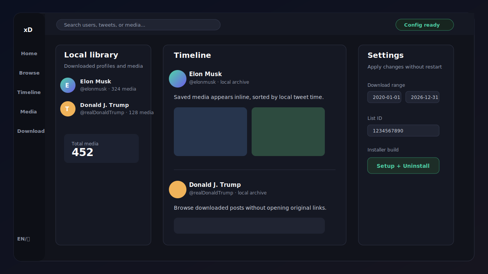

# xDownloader



## English

xDownloader is a local X/Twitter media downloader and browser. It downloads media and text tweets for configured users, can sync users from an X list, and provides a local browser-based UI for browsing users, timeline items, and media.

### Download the Windows installer

For the easiest setup, download `xDownloader-Setup-*.exe` from GitHub Releases and run it.

- The installer lets you choose the install folder.
- Windows gets a normal uninstall entry, plus an uninstaller in the install folder.
- No Python installation is required for the installer build.
- On first run, the app creates `config.json` in the install folder if it does not already exist.
- The Settings tab lets you edit personal configuration and click `Apply` to use it immediately.

### Feature preview

- Browse downloaded media locally without opening original tweet links.
- Timeline view shows local archived posts by time.
- Settings cover account credentials, save path, date range, list sync, tag search, text download, retry, logging, and theme.
- Example preview data uses public-person demo names such as Elon Musk and Donald J. Trump only as mock UI content.

### List sync tips

List ID is preferred. Open a list page on X in your browser and copy the numeric ID from a URL like:

```text
https://x.com/i/lists/1234567890
```

If you do not have the numeric ID, use List Owner plus List Slug. The owner is the account screen name, and the slug is the list name in the URL.

### Run from source

```bash
pip install -r requirements.txt
copy config.example.json config.json
python xdownloader.py
```

Open the local UI if it does not open automatically:

```text
http://127.0.0.1:8765/
```

### Project layout

- `xdownloader.py` and `Start xDownloader.bat` are source launchers.
- `config.example.json` is the template for private `config.json`.
- `xdownloader_app/` contains the runtime code and web UI.
- `packaging/` contains Windows installer and exe build scripts.
- `tests/` contains regression tests.

### Build locally

Build the portable exe and installer:

```powershell
./packaging/build_windows_exe.ps1 -Version local
```

Build only the portable exe:

```powershell
./packaging/build_windows_exe.ps1 -Version local -SkipInstaller
```

Generated files are written to `release/`, which is ignored by Git.

### Bilingual commits

Commit messages should be bilingual so both English and Chinese readers can follow history:

```text
Add installer packaging / 添加安装包构建
Improve settings date picker / 优化设置页日期选择
```

### Tests

```bash
python -m unittest discover -s tests -v
python -m compileall -q xdownloader.py xdownloader_app
```

### Contributing

Contributions are welcome. Please read `CONTRIBUTING.md`, open an issue for larger changes, and include tests for behavior changes. Do not commit generated build artifacts, caches, local test output, downloaded media, or personal config files.

## 中文

xDownloader 是一个本地 X/Twitter 媒体下载器和浏览器。它可以按用户下载媒体和文字推文，可以从 X 列表同步用户，并提供基于浏览器的本地界面来浏览用户、时间线内容和媒体库。

### 下载 Windows 安装包

最简单的使用方式是从 GitHub Releases 下载 `xDownloader-Setup-*.exe` 并运行。

- 安装过程可以选择安装路径。
- Windows 会获得标准卸载入口，安装目录里也会有卸载程序。
- 安装包版本不需要用户安装 Python。
- 第一次运行时，如果安装目录没有 `config.json`，软件会自动创建。
- 个人配置都可以在“设置”页修改，点击“应用”后立即生效。

### 功能预览

- 在本地浏览已下载媒体，不会跳到原推文链接。
- 时间线页面按本地归档时间展示推文内容。
- 设置页覆盖账号凭证、保存路径、日期范围、列表同步、标签搜索、文本下载、重试、日志和主题。
- 预览图里使用 Elon Musk 和 Donald J. Trump 等公众人物名称作为模拟界面内容，不包含真实账号凭证或真实推文数据。

### 列表同步提示

推荐优先使用 List ID。在浏览器里打开 X 列表页面，从类似下面的地址复制数字 ID：

```text
https://x.com/i/lists/1234567890
```

如果没有数字 ID，也可以填写 List Owner 和 List Slug。Owner 是账号用户名，Slug 是列表 URL 里的列表名称。

### 从源码运行

```bash
pip install -r requirements.txt
copy config.example.json config.json
python xdownloader.py
```

如果浏览器没有自动打开，访问：

```text
http://127.0.0.1:8765/
```

### 项目结构

- `xdownloader.py` 和 `Start xDownloader.bat` 是源码运行入口。
- `config.example.json` 是私人配置 `config.json` 的模板。
- `xdownloader_app/` 存放运行代码和网页界面。
- `packaging/` 存放 Windows 安装包和 exe 构建脚本。
- `tests/` 存放回归测试。

### 本地构建

构建便携 exe 和安装包：

```powershell
./packaging/build_windows_exe.ps1 -Version local
```

只构建便携 exe：

```powershell
./packaging/build_windows_exe.ps1 -Version local -SkipInstaller
```

生成文件会放到 `release/`，该目录已被 Git 忽略。

### 双语提交

提交信息应使用中英双语，方便中英文读者理解历史：

```text
Add installer packaging / 添加安装包构建
Improve settings date picker / 优化设置页日期选择
```

### 测试

```bash
python -m unittest discover -s tests -v
python -m compileall -q xdownloader.py xdownloader_app
```

### 参与贡献

欢迎贡献。请先阅读 `CONTRIBUTING.md`；较大的改动建议先开 issue 讨论；涉及行为变化的 PR 请附带测试。不要提交构建产物、缓存、本地测试输出、下载媒体或私人配置文件。
